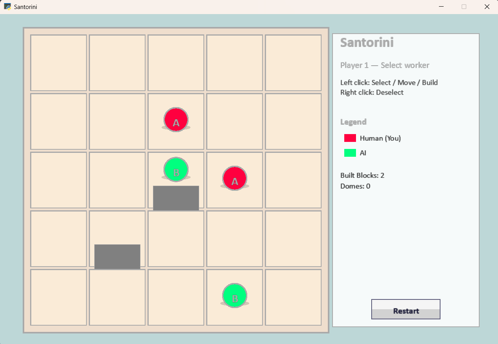

# Santorini Arcade Board Game 🏛️



A digital recreation of the strategic and beautiful board game **Santorini**, built using Python and the `arcade` library. Experience the mythological strategy game where you build and climb to victory!

## 🎮 Features
- **Player vs AI**: Test your wits against an intelligent Minimax-based AI.
- **Adjustable Difficulty**: Choose between Easy (Depth 2) and Difficult (Depth 4) to match your skill level.
- **Beautiful UI**: Modern, clean, and intuitive user interface built with Pyglet and Arcade.
- **Immersive Audio**: Enjoy engaging background music and sound effects as you play. 
- **Smooth Animations**: High-quality visual feedback for moves, drops, and builds.

## 🎵 Credits
A special thanks to **Shadow Fight** for the incredible audio tracks used in this project:
- Lose BGM
- Win BGM
- Main BGM

## 🛠️ Installation

1. Clone the repository:
   ```bash
   git clone https://github.com/RintuRifle/santorini-arcade-board-game.git
   cd santorini-arcade-board-game
   ```

2. Install dependencies (requires Python 3.8+):
   ```bash
   pip install arcade pyglet
   ```

3. Run the game:
   ```bash
   python santorini.py
   ```

## 📜 License
This project is licensed under the MIT License - see the [LICENSE](LICENSE) file for details.
